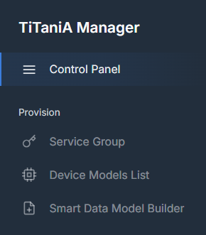
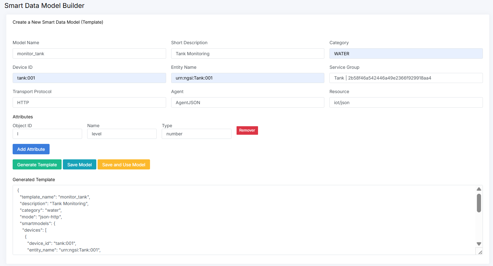
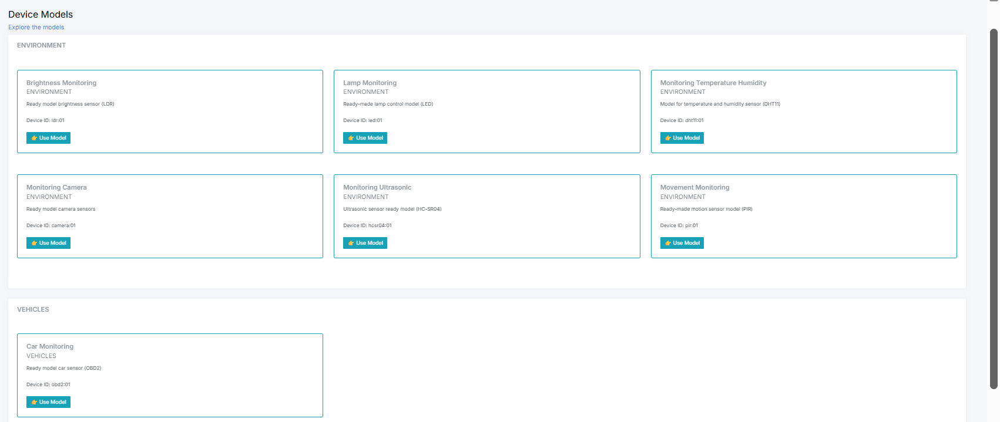

## Device Provisioning

This section explains how to create and configure devices in the IoT Agent, using either a predefined model or a custom model created through the Smart Data Model Builder, and how their attributes are mapped to Orion.

---

## 1. Selecting or Creating a Device Model

You can select a predefined device model from the **Device Models List** or create your own using the **Smart Data Model Builder**.

---

## 2. Creating a Custom Device Model

When creating a custom device model, you must provide the following information:

- Model Name  
- Short Description  
- Category  
- Device ID  
- Entity Name  
- Service Group  
- Transport protocol (HTTP or MQTT)
- Agent (JSON or UltraLight)  
- Device Attributes  

The **Service Group** is selected from a dropdown list that displays the corresponding **Entity Type** and **API Key** previously configured for that Service Group.

### Device Attributes

After filling in the device information, you must define the device attributes by clicking **Add Attribute**.

Device attributes represent the sensor measurements or telemetry values produced by the device. These are considered active attributes, meaning that the device periodically sends their values to the IoT Agent.

For each attribute, the following fields must be provided:

- *Object ID*: Identifier used by the IoT Agent to receive and process the attribute value from the device payload.
- *Name*: Attribute name that will be mapped and stored in the Orion Context Broker entity.
- *Type*: Data type of the attribute, such as String, Number, or other supported types.

Multiple attributes can be added to represent different sensors or telemetry values generated by the device.

After completing the form, click **Generate Template**.

The Generate Template action displays the JSON payload corresponding to the device configuration based on the information provided. This template can be used as a reference for device provisioning and data transmission.

Then choose one of the following options:

- **Save Model**: saves the model in the database and makes it available in the **Device Models List**
- **Save and Use Model**: saves the model, displays it in the list, and automatically configures the selected IoT agent to use it

---

## 3. IoT Agent Configuration Context

The Service Group defines:

- The *resource* where the IoT Agent is listening (automatically generated based on the selected agent)
- The *apikey* used to authenticate requests

Once both are recognized, the measurements become valid.

---

## 4. Agent Compatibility Rule

The selected agent must be compatible with the *resource* generated in the Service Group:

- If the **UltraLight protocol** is selected, the device must use the **AgentUltraLight**
- Otherwise, the default agent is **JSON**

---

## 5. Provisioning a Device (from a model)

To use a predefined model, select one from the list and click **Use Model**.

This action provisions the device in the **IoT Agent**.

---

## 6. Device Mapping Behavior

Since the device was explicitly provisioned, the IoT Agent can map attributes before forwarding the request to **Orion**.