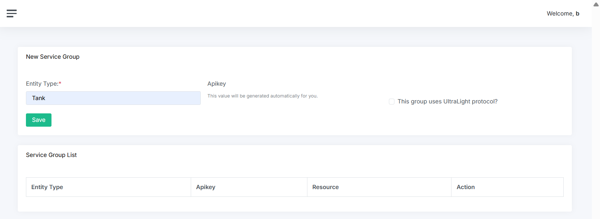
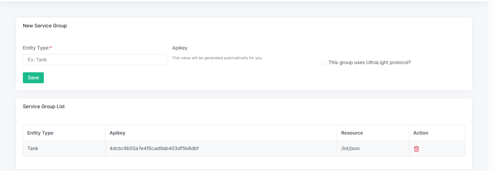

## Creating a Service Group

A **Service Group** in TiTaniA is a configuration used to group IoT devices that share the same settings, such as protocol, authentication, and data processing rules.

It simplifies device management by centralizing how devices are provisioned and how their data is handled by the platform.


- On the interface, select **Service Group**. 


A **Service Group** in TiTaniA requires the user to provide an `Entity Type` during configuration. After clicking **Save**, the system automatically generates an `Apikey` and a `Resource`.

If the **UltraLight protocol** will be used, it is necessary to install the **AgentUltraLight** service from the Marketplace under **Available Services** before provisioning the Service Group.

These values are used by devices to send data that will be processed by the IoT Agent and forwarded to the Orion Context Broker, even if the devices have not been explicitly provisioned.

---



- Service Group created.




In this example, the **IoT Agent** is configured to use the `/iot/json` endpoint, and devices authenticate by including the apikey `4dcbc8b55a7e4f6cad9ab403df5b8dbf`.

For a **JSON IoT Agent**, this means that devices will send GET or POST requests to:

```
http://agentjson:7896/iot/json?i=<device_id>&k=4dcbc8b55a7e4f6cad9ab403df5b8dbf
```

<!--
Quando uma medição do dispositivo (e.g. sensor umidade) é enviada pelo arduino na URL do recurso, ela precisa ser interpretada e passada para o **Orion**. O atributo `entity_type` fornece um `type` padrão para cada dispositivo que fez uma solicitação (neste caso, os dispositivos anônimos serão conhecidos como entidades `Sensor`.
-->