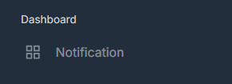
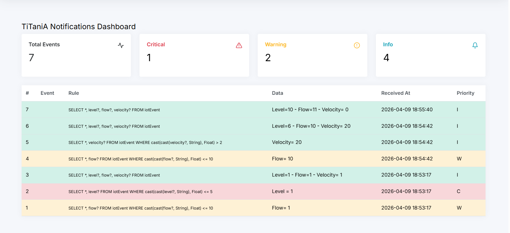

# Events Dashboard

### Overview
The **Events Dashboard** provides a centralized view of event notifications generated from data collected by IoT sensors connected to the platform.

### Purpose
This feature enables users to navigate to the Events Dashboard through the main menu in order to monitor, analyze, and respond to events detected from sensor data in real time, supporting timely and informed decision-making.

### Description
The dashboard processes incoming data from IoT devices and displays events based on predefined rules, thresholds, or anomaly detection mechanisms.

Through the dashboard, users can:
- View event notifications derived from sensor data
- Monitor real-time and historical events
- Identify anomalies, alerts, or critical conditions
- Take appropriate actions based on detected events

### Key Features
- Real-time event detection from IoT sensor data
- Configurable rules and thresholds for event generation
- Centralized monitoring interface
- Support for operational decision-making

### Benefits
- Enhances visibility into IoT device activity
- Enables rapid detection of anomalies and incidents
- Improves response time to critical situations
- Supports data-driven decision-making

---
