# Rule Editor

## Overview

The **Rule Editor** is a visual interface that enables users to create, configure, and manage event processing rules for the IoT platform.

It supports a **block-based approach** for building rules, allowing both non-technical and advanced users to define event processing logic without requiring deep knowledge of Event Processing Language (EPL).

The editor integrates with the **Perseo CEP** service to process events in real time. The Perseo service must be properly installed and available in the platform environment before creating and deploying rules.

---

## Interface Structure

The Rule Editor is composed of the following components:

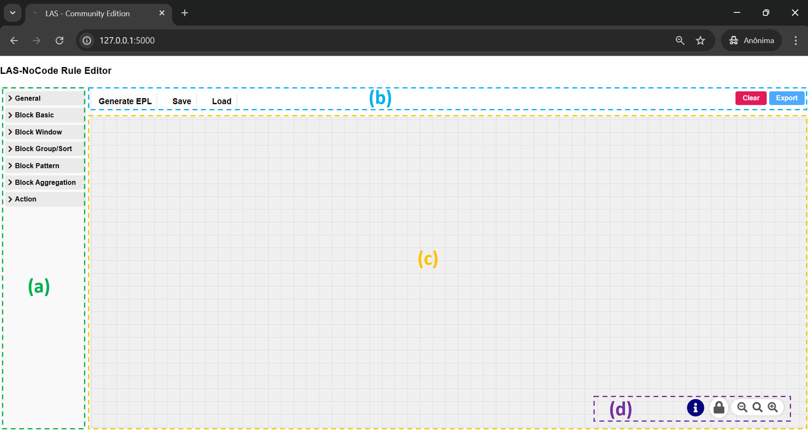

- **(a) Side Menu**  
  Provides access to all available blocks used to construct rules.

- **(b) Top Menu**  
  Contains actions for rule generation, persistence, and workspace management.

- **(c) Editor Workspace**  
  The main area where rules are visually created and connected.

- **(d) Bottom Control Panel**  
  Provides additional controls and editor interaction options.

---

## How It Works

Rules are created by connecting blocks that represent different parts of an event processing pipeline.

- Each block defines a specific aspect of the rule (selection, filtering, aggregation, etc.)
- Blocks are connected to form a valid rule structure
- The visual flow is automatically converted into **EPL** when executed

### Connection Rules

- All blocks must be directly connected to the rule, except:
  - `GROUP BY`
  - `ORDER BY`

- These exceptions:
  - Must be connected to a `SELECT` block
  - Extend an existing query instead of defining a rule independently

This model ensures:
- Valid EPL generation
- Modular and composable rule design
- Safe and incremental rule creation

---

## Block Categories

Blocks are organized by functionality, enabling a structured and scalable rule creation process.

---

### General

The **General** category defines global rule properties.

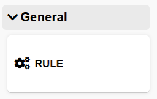

#### Rule Name

Defines the unique identifier of the rule.

- Must be **unique**
- Should be **descriptive**
- Used in rule management and integration

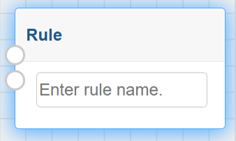

---

### Basic Blocks

These blocks define the core logic of a rule.

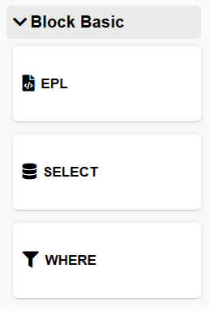

#### EPL Block

Allows full manual rule definition using EPL.

- Intended for advanced users
- Requires knowledge of:
  - Perseo CEP
  - EPL syntax
- Provides maximum flexibility

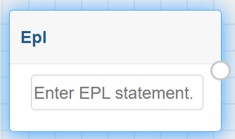

#### SELECT Block

Defines which event attributes will be selected.

- No EPL knowledge required
- Automatically generates the base EPL structure
- Recommended for standard use cases

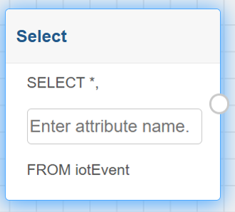

#### WHERE Block

Applies filtering conditions to events.

- Extends the SELECT block
- User defines:
  - Attribute
  - Condition
- Automatically translated to EPL

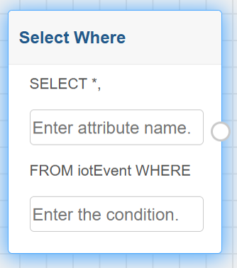

---

### Window Blocks

Define how events are grouped over time or quantity.

> ⚠️ These blocks generate standalone rules and do not support complex logic (e.g., aggregation or patterns).

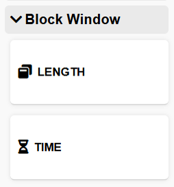

#### TIME Window

Defines a time-based observation window.

- User specifies:
  - Attribute
  - Time interval

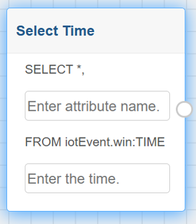

#### LENGTH Window

Defines a count-based observation window.

- User specifies:
  - Attribute
  - Number of events

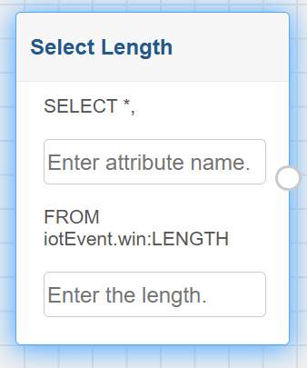

---

### Group and Sort

Used to refine the output of SELECT-based rules.

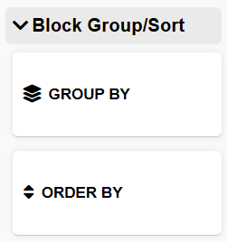

#### GROUP BY

Groups events by a specific attribute.

- Must be connected to a SELECT block
- Used for entity-based analysis

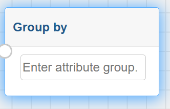

#### ORDER BY

Sorts events based on an attribute.

- Must be connected to a SELECT block
- Supports ordering by value, timestamp, etc.

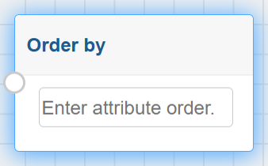

---

### Pattern Blocks

Used to define complex event patterns.

> ⚠️ Advanced usage — requires EPL pattern knowledge

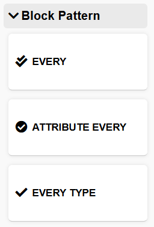

#### Every

Defines fully custom event patterns.

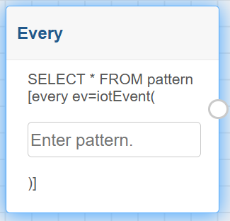

#### Attribute Every

Defines recurring patterns based on an attribute.

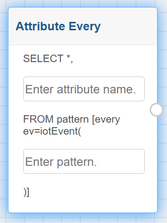

#### Every Type

Extends pattern detection with entity type filtering.

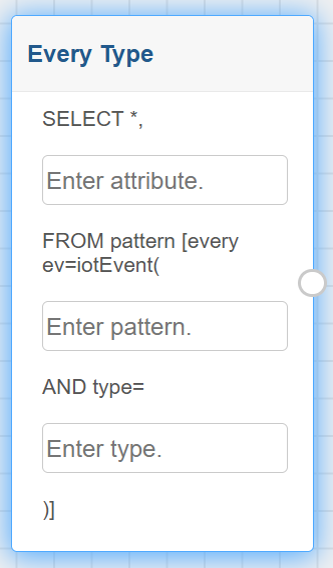

---

### Aggregation Blocks

Apply aggregation functions over event streams.

- Must be connected to a SELECT block
- No EPL knowledge required

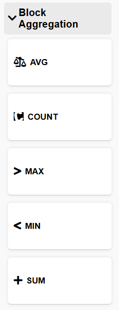

Available functions:

- **AVG** – Average value  

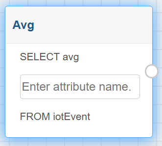

- **COUNT** – Number of events  

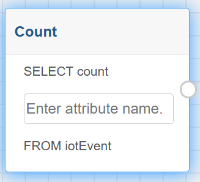

- **MAX** – Maximum value  

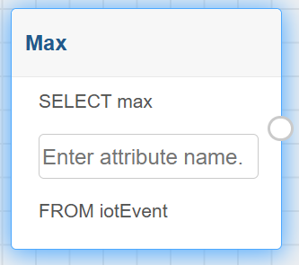

- **MIN** – Minimum value  

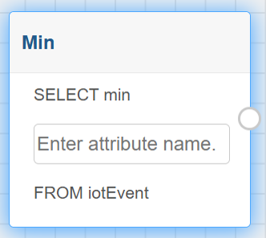

- **SUM** – Total sum  

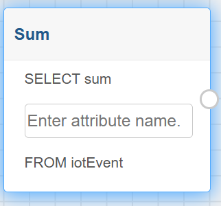

---

### Action Blocks

Define how rule results are delivered.

These blocks represent the **final step** of a rule.

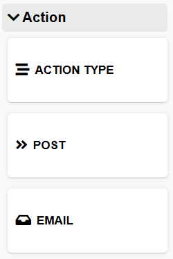

#### Action Type

Defines the notification method:

- `POST`
- `EMAIL`

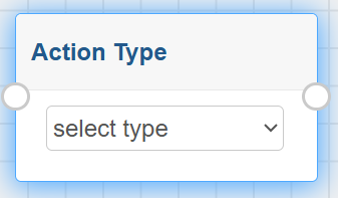

#### POST Action

Sends notifications to an external system.

- Requires:
  - Endpoint URL
  - Message template

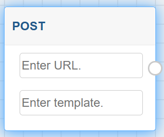

#### EMAIL Action

Sends notifications via email.

- Requires:
  - Sender
  - Recipient
  - Subject
  - Message template

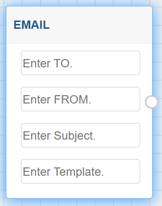

---

## Top Menu Actions

### Generate EPL

- Converts the visual rule into EPL
- Registers the rule in **Perseo CEP**
- Makes the rule active for event processing

### Save

- Stores the current rule configuration
- Enables reuse and versioning

### Load

- Loads previously saved rules
- Restores the block flow in the editor

### Clear

- Removes all blocks from the workspace
- Resets the editor

### Export

- Exports the rule definition
- Useful for:
  - Backup
  - Sharing
  - Migration

---

## Key Capabilities

- Visual rule creation (no-code / low-code)
- Real-time event processing
- Integration with IoT sensor data
- Automatic EPL generation
- Flexible notification mechanisms

---