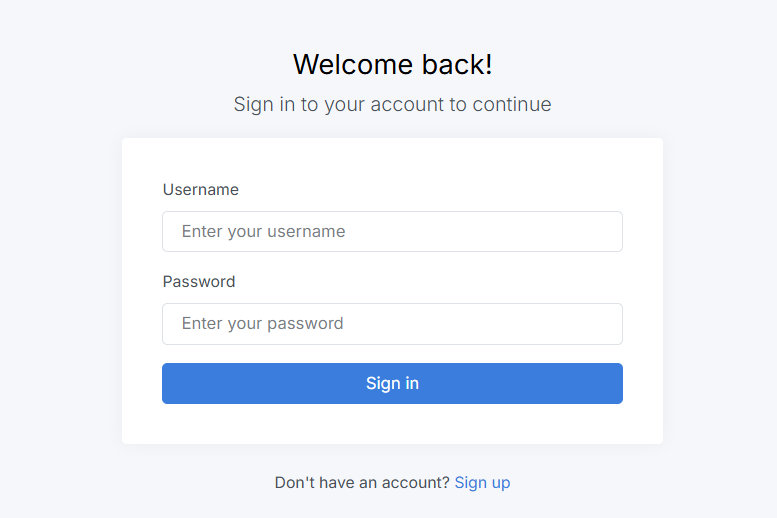
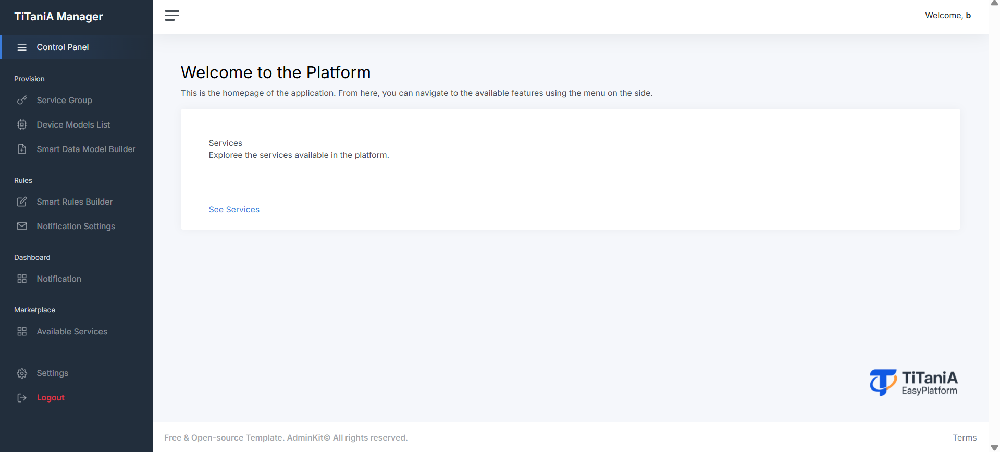

## Requirements before TiTaniA installation

Use your windows machine with, Virtual Box, VMware. Or  a machine with linux. Or Cloud Service as AWS, IBM Bluemix, Azure or Google. 

Recommended:


*configuration*: 1 vCPU, 1GB RAM and HDD or SSD.

*Install any Linux distribution, but Ubuntu Server >=24.04 LTS, Docker and Docker Compose and Bash (for running the install script)*.


Open ports on the firewall if you are using a Cloud Service:

```
   22/TCP - SSH 
 5000/TCP - Web Interface
 1026/TCP - Orion Contex Broker (HTTP or HTTPs)
27017/TCP - MongoDB "DataBase"
 3306/TCP - MYSQL "DataBase"
 3000/TCP - Grafana
 4041/TCP - AgentIoT-Json
 7896/TCP
 5050/TCP - Cygnus
 5080/TCP
   80/TCP - NGINX
```


## TiTaniA Easy Platform Installation

Follow the steps below to install the platform.

---

### 1. Clone the repository

```bash
git clone https://github.com/Rosiberto/titania-community.git
````

---

### 2. Navigate to the project directory

```bash
cd titania-community
```

---

### 3. Give execution permission to the install script

```bash
chmod u+x install.sh
```

---

### 4. Run the installer

```bash
./install.sh
```

---

## Alternative: Manual installation

If you prefer not to use the install script, follow these steps:

1. Repeat steps 1 and 2  
2. Run the following command:

```bash
sudo docker compose up -d
```

---

### Installation complete

The system is now ready to use.

```
```

## Accessing the TiTaniA user interface

- You can use your preferred web browser
- Access: http://*localhost*
- Add a new account



After logging in, you will be redirected to the home page, where you will have access to all available features.

