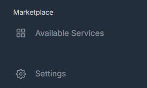
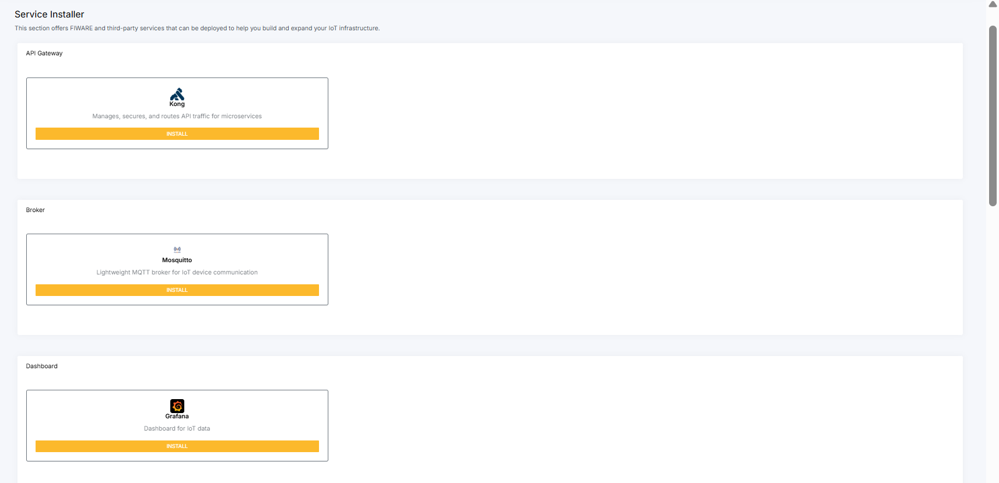
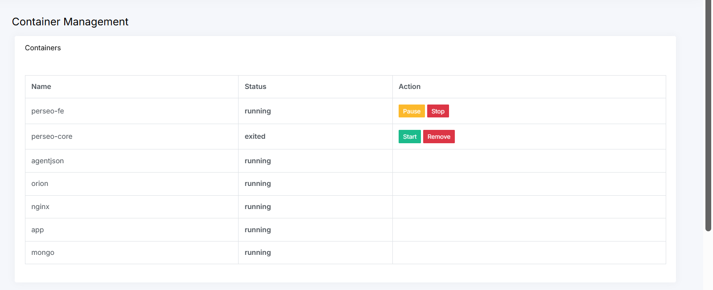

## Marketplace - Available Services

The **Marketplace** section provides access to the **Available Services** option, where users can view all services supported by the system that can be installed and integrated with other components.

### Service Catalog

Services are organized into categories to simplify navigation and selection (e.g., databases, brokers, API gateways).

### Installation

To install a service, the user must:

1. Navigate to **Marketplace > Available Services**  
2. Select the desired service  
3. Click on **Install**  

### Service Status

After installation, the service becomes available and starts running. The user can monitor the service status by navigating to:

**Settings > Containers**

In this section, the service will be listed with the status **Running**.

#### Service Management

After installation, the service becomes available and can be managed through its lifecycle.

The following statuses and actions are available:

- **Running**: Indicates that the service is currently in execution  
- **Start**: Starts a service that is stopped  
- **Pause/Stop**: Pauses or stops a running service  
- **Remove**: Removes the service from the environment  

---