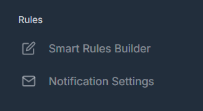
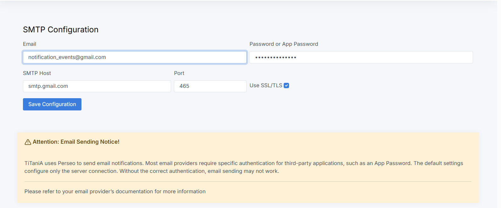

## Notification Settings

The **Notification Settings** option in the Rules menu allows users to configure an email account that will be used to receive event notifications. This configuration is also utilized by the Email block within the rule editor.

Additionally, this configuration is used by the **Perseo** service.

### Configuration

To set up the email integration, the user must provide the following information:

- Email address  
- Password  
- SMTP server (provider)  
- Port  

### Perseo Service Integration

Before installing the **Perseo** service, the email configuration must be completed. When the Perseo service is started, it automatically retrieves the configured email settings and initializes using this information.

If the Perseo service is already running, it is necessary to remove and restart the service for the new email configuration to be applied.

### Notes

Users should consult their email provider for the correct configuration details and security requirements. It is important to verify how third-party applications are authorized to use the provider’s email service with user credentials.

---