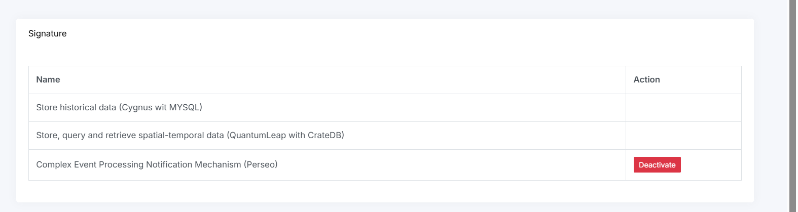

## Subscriptions for Marketplace Services

Some services available in the Marketplace require a subscription to the Orion Context Broker in order to receive notifications.

All these services must be installed beforehand for the corresponding options to be enabled in the **Settings** menu. If a service is not installed, the corresponding button will not be displayed.

For all cases, simply click the **Activate** button to create the subscription.

### Available Subscriptions

- Store historical data
- Store, query and retrieve spatial-temporal data
- Complex Event Processing Notification Mechanism

---